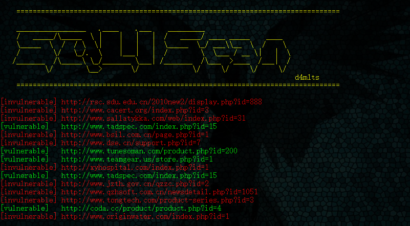

## SQLI SCAN

Sqli_Scan , 批量sql注入扫描器

首先从 bing.com 上根据关键词搜索符合条件的链接，再根据链接进行自动判断是否可能存在注入

## 依赖

- python3


## 基本使用

```

    ===============================================================================

    _________________   .____    .___    _________
    /   _____/\_____  \ |    |   |   |  /   _____/ ____ _____    ____
    \_____  \  /  / \  \|    |   |   |  \_____  \_/ ___\\__  \  /    \
    /        \/   \_/.  \    |___|   |  /        \  \___ / __ \|   |  \
   /_______  /\_____\ \_/_______ \___| /_______  /\___  >____  /___|  /
           \/        \__>       \/             \/     \/     \/     \/
                                                                        d4m1ts
    ===============================================================================

usage: sqli_scan.py [-h] [-k inurl:example] [-p 5] [-e search engine]

optional arguments:
  -h, --help        show this help message and exit
  -k inurl:example  sql injection keyword
  -p 5              page of websites to look for in search engine
  -e search engine  the search engine you want to use. bing,yahoo
```

`python sqli_scan.py -k inurl:php?id= -p 3 -e bing`


